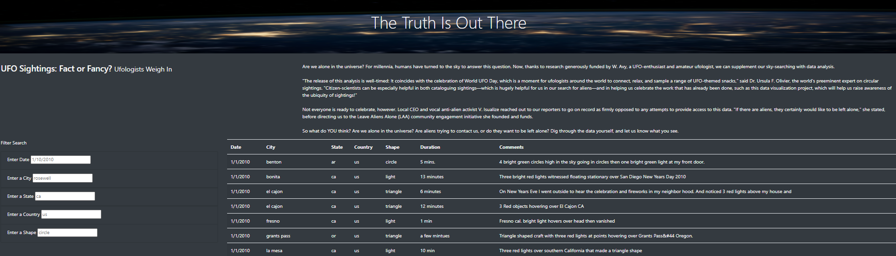
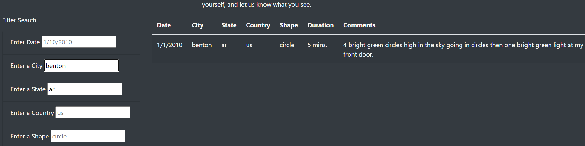
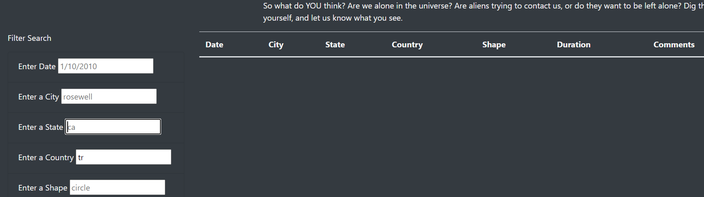
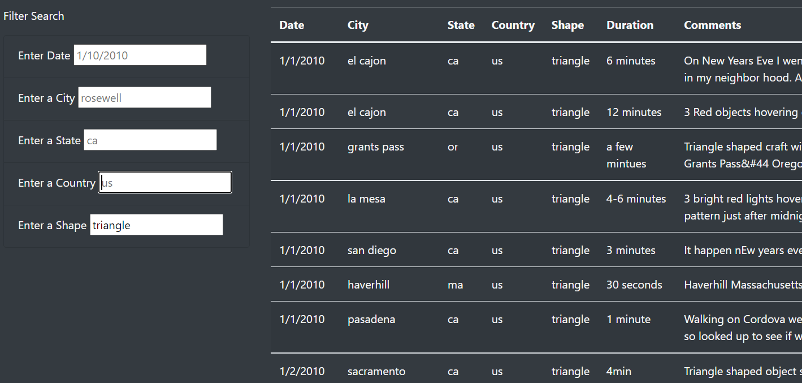
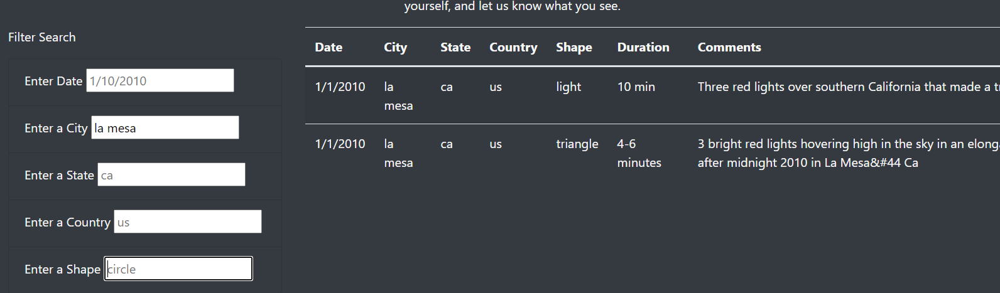
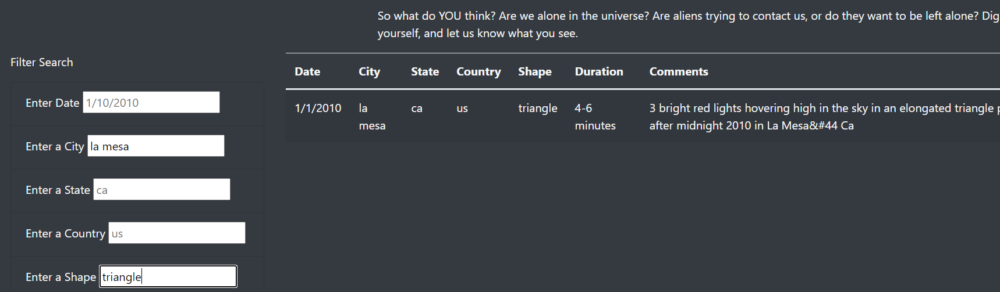
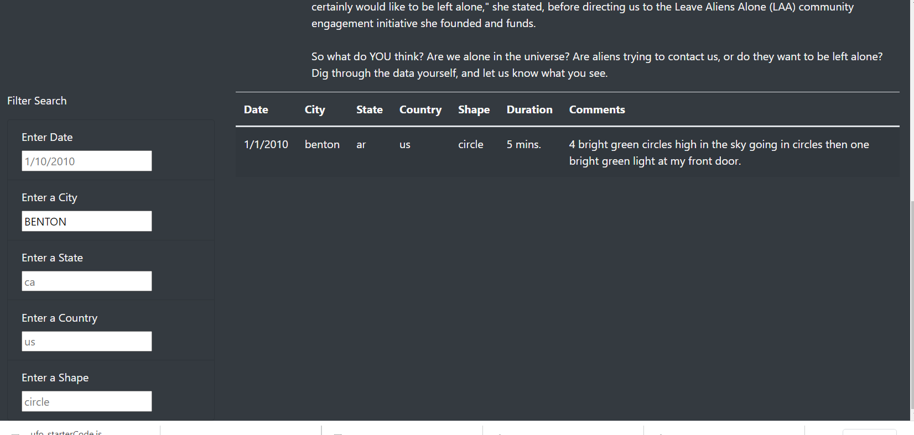
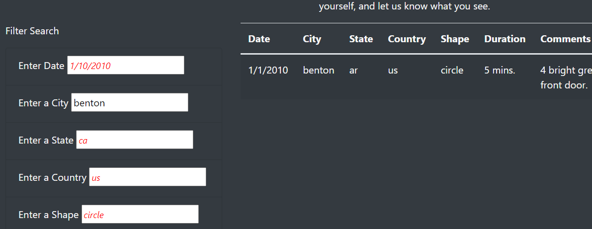
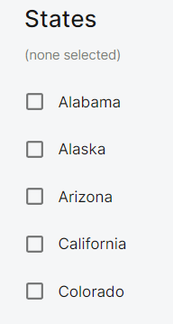

# Searching HTML table (JSON) on user input - UFOs
### Filter UFO sightings on multiple criteria using JavaScript 

## Overview of Project: 
This project builds a table using data stored in a JavaScript array, creates filters to make table fully dynamic that reacts to user input, places the table into an HTML file for viewing, customizes webpage using Bootstrap, and adds functional filters to interact with visualizations.
### Purpose:
Purpose is to create, populate, and dynamically filter a table using JavaScript and HTML. UFO sighing data is stored in JavaScript array. Using the JavaScript array, table is placed on HTML file for easy viewing and user can do a search on the HTML page for certain fields such as city, date, state, country and shape.

### Tools used: 
VSCode, JavaScript, JavaScript ES6+, JSON, HTML, CSS, Bootstrap, Google Chrome DevTool.

## Analysis: 
This project allows users more in-depth analysis of UFO sightings. We do this with the implemenation to filter for multiple criterias at the same time which includes filters for the city, state, country, date and shape. 
We initiate the search by attaching an event listener to pick up changes that are made to each filter. The following image displays the starting html with giving Json data.



As seen in the picture above on the left side "Filter Search" is listed in input boxes. Each input has a default value which clears as soon as there is an "onchange" event is triggered. The following shows the results of a search on state AR and city name Benton. 



### Results:

How to conduct a search on UFO's data: Once the form is loaded scroll up and down to see the full list of UFO sites. If you like to see the the countries move your mouse over to the "Filter Search" area and start typing on the Country inbox. This will trigger an "onchange" event. Once the user completes typing the country name ie US or CA and hits enter or clicks to anywhere on the screen or another field this text (country) will be searched in the json data.  If the data is found html table will be updated with the new list and if not found html table will be blank as seen in the image below.



Lets do a search on "Shape" field. Once you type "triangle" on the "Shape" inbox and hit enter or click anywhere on the screen, the event listener will pick up changes and run a search using filter method then the table will be reloaded on the html and the following will be displayed as seen in the image below. 



#### Filter UFO sightings on multiple criteria
Filters on top of filters! This projects allows us to that. Once the search is completed you can either reload the page to do another searh on the original data or move your mouse over to another field to do multiple search and enter your search criteria. The below is an example on searching for city "la mesa" which displays 2 records on the search result, the first image. If we continue to do another filter on "Shape" field by clicking and typing "triangle" you will see that there will be only one record displayed. The result will be updated user input data record on UFO's with the filtered search. Try the filter on filters by entering City: El Cajon, then Shape: ligh and then Date: 1/1/2020. You will see that your first filter will return 5, second filter 2 and the last filter 1 record.





You will need to create a new function that will replace your handleClick(); function. This function saves the element, value, and the id of the filter that was changed.
Create an if-else statement to add filter data from input, or clear the filter if no input data exists.
Additionally, create a function named filterTable(); that will perform the following actions:
Set the filtered data to the table.
Loop through all of the filters and keep any data that matches the filter values.
Rebuild the table by calling the buildTable(); function created earlier.
Finally, using d3.selectAll();, attach an event listener to pick up changes that are made to each filter.

## Summary:
In addition to "Date" search field this project offers multiple searches on json data which is a list of UFO's sigthing. Event listener picks up on user input that are made to each filter and rebuilds the table by going through all of the filters and keeps any data that matches the filter values. Finally the table is reset with the filtered data.

### Drawback: 
One drawback is if you enter upper case in your filter search you will not have the result even if your search criteria exist in the table data. ie if you search for a city "Benton" or "BENTON" you will have a blank table as a result of your search.
### Recommendation for further development:
1. Search criteria should accept upper or mixed cases and display the matching records. Implementation of it can be done as seen in the picture below with the use of case conversion funcion toLowerCase().



2. Input fields normally have default data to give user an example data. But is is usually in italic font and sometime in different colours to draw attention. I've added a style for the placeholder in .css file to implement this. The result is as seen in the image below. Including the following style in the .css will implement the look in the image below: ``` ``` ```input::placeholder {
  color: red;
  font-size: 1.2em;
  font-style: italic;
}```



3. Another recommendation is to display a tick box for the user to pick from availabel countries and update the html table depending on the country selection dynamically. We could also include the States selection as check boxes as seen in the image below or in the link <https://data.neonscience.org/data-products/explore>. This would allow the user to do a faster search with a click of a mouse. 

